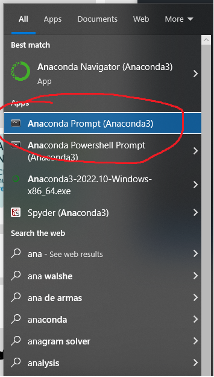

## 其他语言教程
[GO TO ENGLISH READ ME](README.md)

##　原始教程以及应用手册
[ORIGINAL ENGLISH README](README_ORIGINAL_EN.md) | [原版中文README在此](README_ORIGINAL_EN.md)

# "Talking Head(?) Anime from A Single Image 3: Now the Body Too" 安装教程

## 硬件要求

这两个程序都需要一个最新的和强大的 Nvidia GPU 来运行。我个人可以用 Nvidia Titan RTX 运行它们。然而，我认为最近的高端游戏 GPU，如 RTX 2080、RTX 3080 或更好的 GPU 也能做到。最新测试RTX 4090毫无问题

`ifacialmocap_puppeteer` 需要一个能够从视频流计算 [blend shape parameters](https://developer.apple.com/documentation/arkit/arfaceanchor/2928251-blendshapes) 的 iOS 设备。这意味着该设备必须能够运行 iOS 11.0 或更高版本，并必须具有 TrueDepth 前置摄像头。（有关更多信息，请参阅 [此页面](https://developer.apple.com/documentation/arkit/content_anchors/tracking_and_visualizing_faces)。）换句话说，如果您有 iPhone X 或更好的手机，您就应该一切就绪。我个人使用的是 iPhone 12 mini。

## 软件要求

### GPU 相关软件 INSTALL CUDA 版本一定是 cuda 11.7 , 按系统选 Windows 10 或者 11 
CUDA一定要装 11.7!!!!!!

这里安装cuda链接[CUDA Toolkit](https://developer.nvidia.com/cuda-11-7-0-download-archive?target_os=Windows&target_arch=x86_64) 

### 安装 Anacoda! 然后打开Anacoda Prompt一个一个命令运行


安装 [Anaconda](https://www.anaconda.com/) 然后再打开Anaconda Prompt运行下面的命令:




```
> conda create -n talking-head-anime-3-demo python=3.10
```

```
> conda activate talking-head-anime-3-demo
```

```
> conda install pytorch torchvision torchaudio pytorch-cuda=11.7 -c pytorch -c nvidia
```

```
> conda install scipy
```

```
> conda install matplotlib
```

```
> conda install -c conda-forge notebook
```

```
> conda install -c conda-forge ipywidgets
```

```
> jupyter nbextension enable --py widgetsnbextension
```

## 下载模型

在运行程序之前，您需要从此 [Dropbox 链接](https://www.dropbox.com/s/y7b8jl4n2euv8xe/talking-head-anime-3-models.zip?dl=0) 下载模型文件，并将其解压到存储库根目录下的 ``data/models`` 文件夹中。最终，数据文件夹应该看起来像:

```
+ data
  + images
    - crypko_00.png
    - crypko_01.png
        :
    - crypko_07.png
    - lambda_00.png
    - lambda_01.png
  + models
    + separable_float
      - editor.pt
      - eyebrow_decomposer.pt
      - eyebrow_morphing_combiner.pt
      - face_morpher.pt
      - two_algo_face_body_rotator.pt
    + separable_half
      - editor.pt
          :
      - two_algo_face_body_rotator.pt
    + standard_float
      - editor.pt
          :
      - two_algo_face_body_rotator.pt
    + standard_half
      - editor.pt
          :
      - two_algo_face_body_rotator.pt
```

模型文件使用 [Creative Commons Attribution 4.0 International License](https://creativecommons.org/licenses/by/4.0/legalcode) 发布，这意味着您可以将其用于商业目的。但是，如果您分发它们，您必须在其他方面说明我是创建者。

## 运行 `manual_poser` 桌面应用程序

打开一个 shell。将工作目录更改为存储库的根目录。然后运行:

```
> python tha3/app/manual_poser.py
```

## 运行 `ifacialmocap_poser`

首先，在 iOS 设备上运行 iFacialMocap。它应该会显示设备的 IP 地址。记下它。保持应用程序打开

```
> python tha3/app/ifacialmocap_puppeteer.py
```

在 "Capture Device IP" 文本框中输入您之前记下的 iOS 设备的 IP 地址。


点击右侧的 "START CAPTURE!" 按钮。


如果程序连接正常，当您移动头部时，应该能看到窗口底部的数字发生变化。


现在，您可以加载一个角色的图像，它应该遵循您的面部动作。

## 输入图像的限制

为了使系统正常工作，输入图像必须遵循以下限制：

* 它应该是 512 x 512 的分辨率。（如果演示程序接收到其他大小的输入图像，它将将图像调整为此分辨率，并在此分辨率输出。）
* 它必须具有alpha通道。
* 它必须只包含一个人形角色。
* 角色应该立着直立并面对前方。
* 角色的手应该在头部下方并远离头部。
* 角色的头部大致应该包含在图像上半部的中间128 x 128框中。
* 不属于角色的所有像素的alpha通道（即背景像素）的alpha通道必须为0。

示例图像:


更多关于输入图像的详细信息，请参阅项目的 [write-up](http://pkhungurn.github.io/talking-head-anime-3/full.html#sec:problem-spec)